# To-Do List

A To-Do Flutter application to manage your TaskList.

# Android Screenshots of To-Do List Application

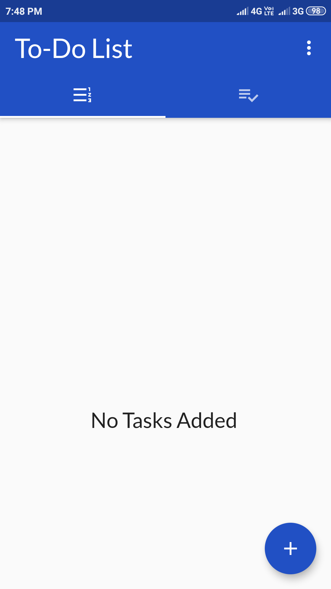 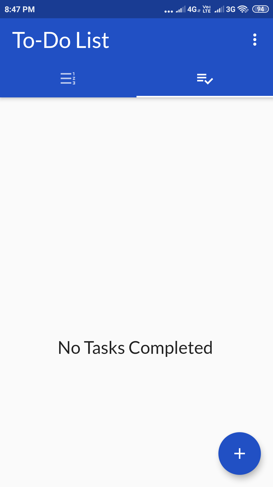 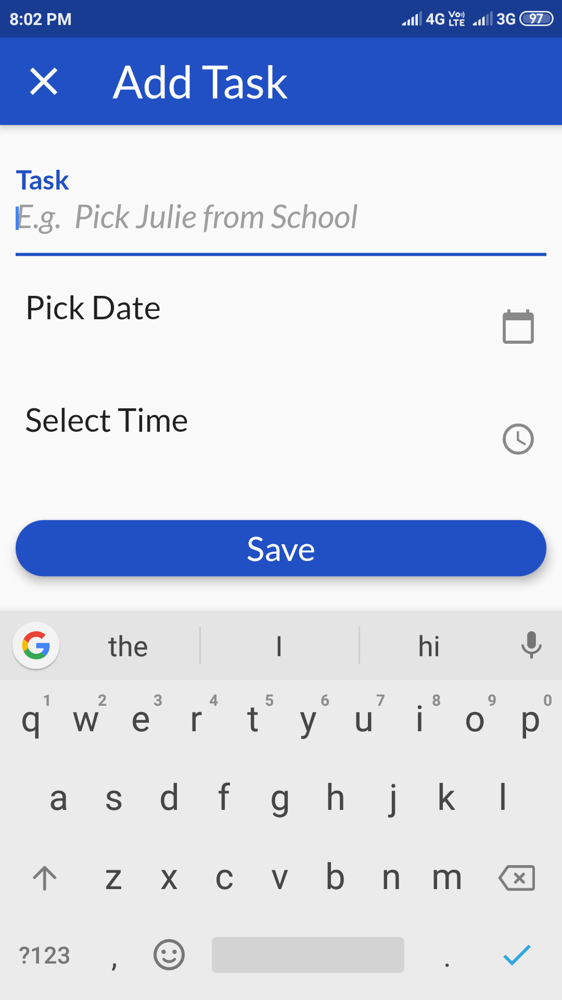 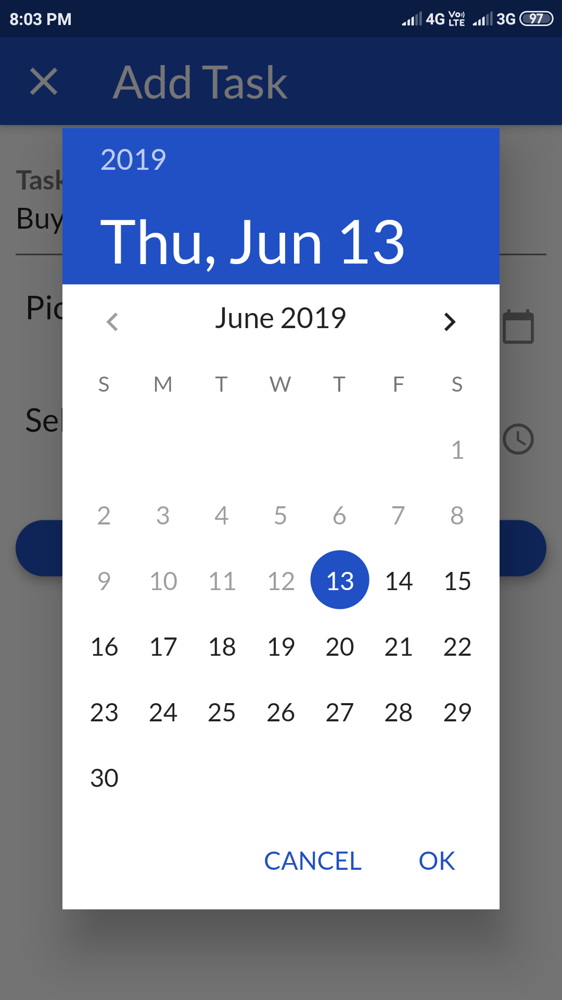 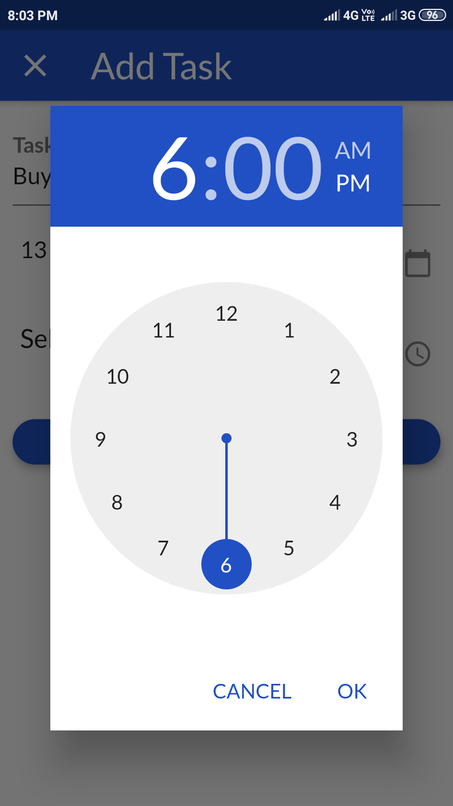 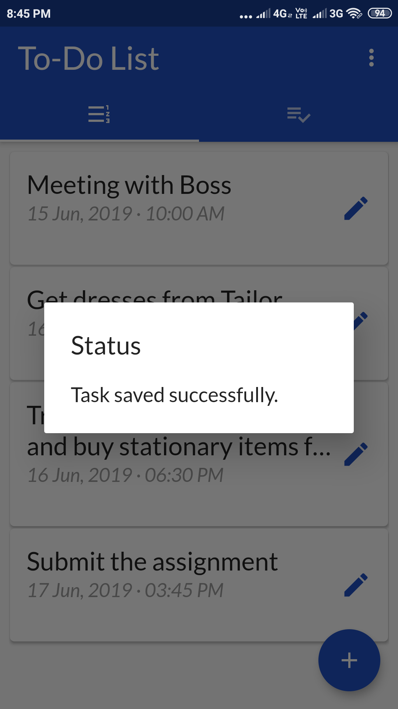 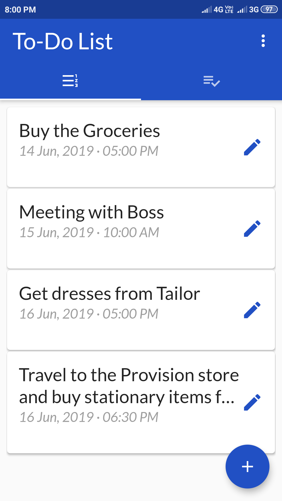 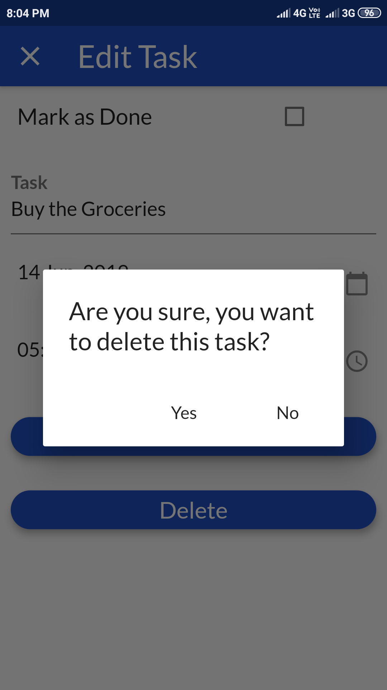 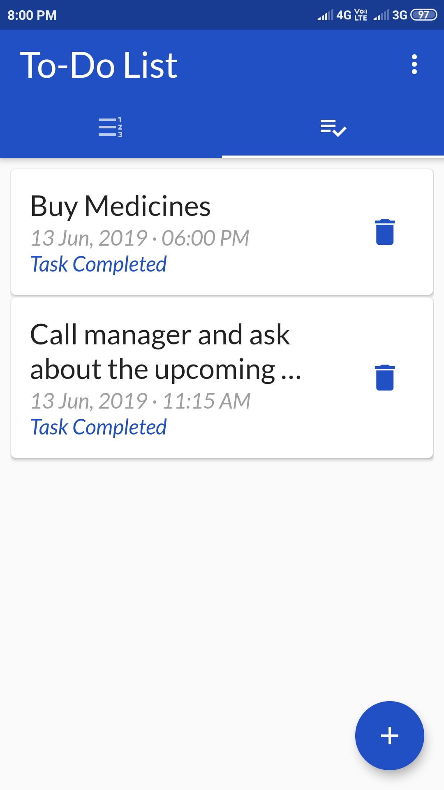 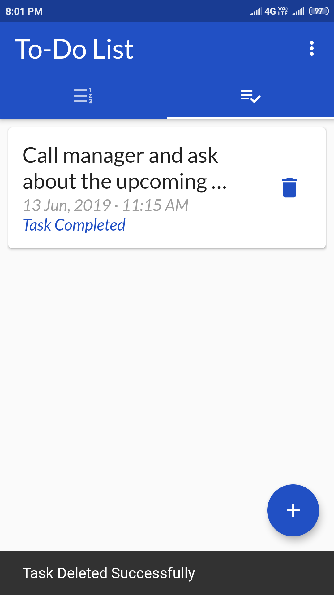 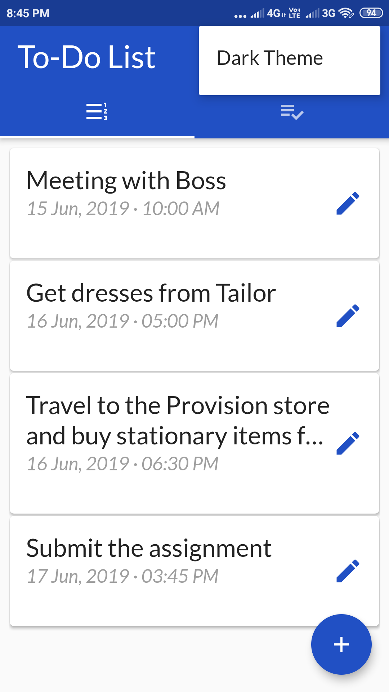 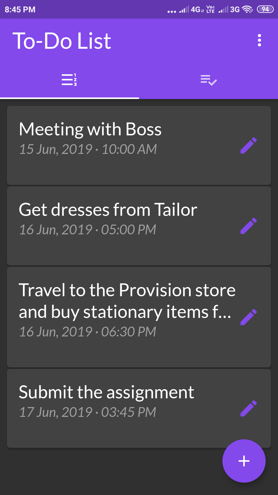 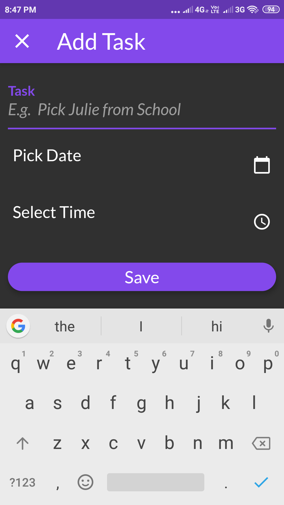 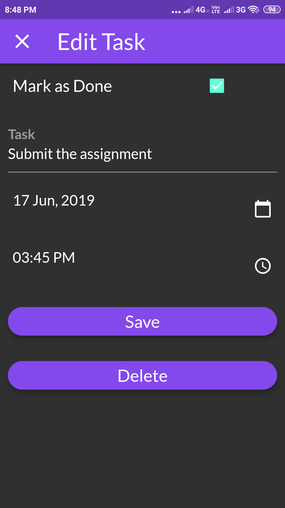 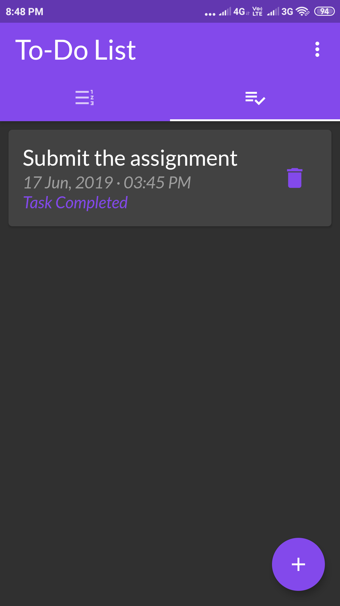

## Application Features
* Create New Tasks from the Action button.
* Locally store created Task using database file.
* Fetch and Display Complete and InComplete Tasks from the locale db file.
* Mark a Task as Done.
* Update and Delete feature from the local db file.
  
---
## Note about the source code

Please note that I was trying my hands on Flutter. Therefore, there are still things which are not fully implemented or tested.
Suggestions and Improvements are most Welcomed!  :)
